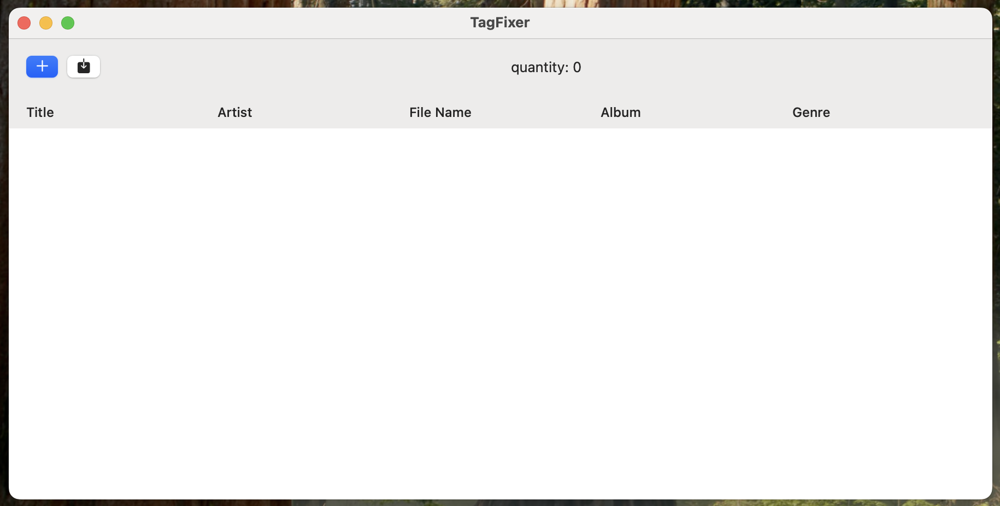
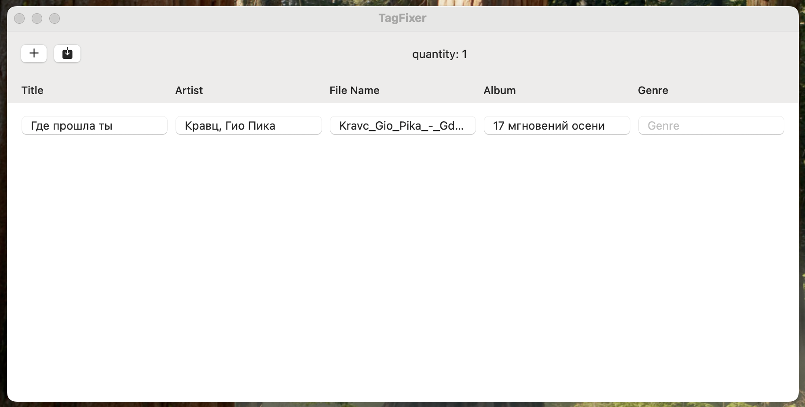
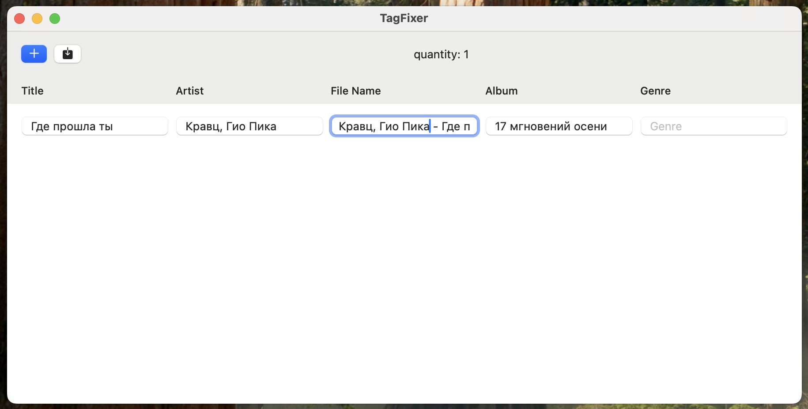

# 🎧 TagFixer
TagFixer is a minimalistic macOS application for editing MP3 file tags.  
Simple. Fast. No frills.

## 📸 Screenshots
<!-- 
 -->
   
     
  
<!-- 
 -->

## 🔧 Opportunities
- Opening `.mp3` files using a user-friendly interface
- Viewing and editing tags:
  - title
  - artist
  - file name 
  - album 
  - genre 
- Saving changes with one click
- Full local operation without sending data to the network

## 🧰 Technologies
- Swift
- SwiftUI
- swift-format: for code styling
- Xcode (macOS target)
- ID3TagEditor
